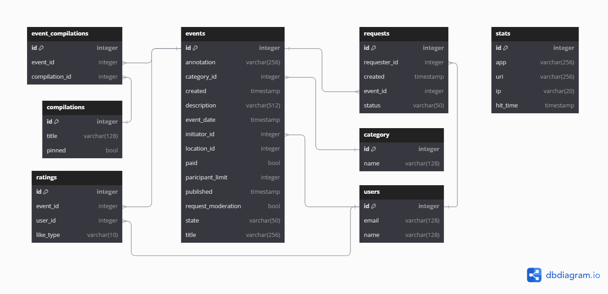

# java-explore-with-me

### Описание

Свободное время — ценный ресурс. Ежедневно мы планируем, как его потратить — куда и с кем сходить.
Сложнее всего в таком планировании поиск информации и переговоры.
Нужно учесть много деталей: какие намечаются мероприятия, свободны ли в этот момент друзья, как всех пригласить и где
собраться.

Реализован бэкэнд приложения — афиши.
В этой афише можно предложить какое-либо событие от выставки до похода в кино и собрать компанию для участия в нём.

Приложение состоит из двух микросервисов:

- Основной сервис
- Сервис статистики

### Дополнительная функциональность:

Возможность ставить лайки и дизлайки событию, сортировка по рейтингу (по количеству лайков).
При повторном лайке события, лайк удаляется. Аналогично для дизлайков. Если лайкнуть событие, которому ранее был поставлен дизлайк,
то дизлайк сменится на лайк. Так же и наоборот лайк сменяется на дизлайк.

### Стек:

- Java 21
- Spring Boot
- Hibernate, Criteria API
- PostgreSQL 16.1
- Maven
- Lombok
- Junit5, Mockito
- Postman
- Docker

## ТЗ

- [Техническое задание для API основного сервиса](./ewm-main-service-spec.json)
- [Техническое задание для API сервиса статистики](./ewm-stats-service-spec.json)

## Postman

- [Тесты API основного сервиса](./postman/ewm-main-service.json)
- [Тесты API сервиса статистики](./postman/ewm-stat-service.json)
- [Тесты API рейтинга (дополнительная функциональность)](./postman/feature.json)

## [Ссылка на последний pull-request](https://github.com/MoonTwilightShadow/java-explore-with-me/pull/3)

## Схема базы данных

